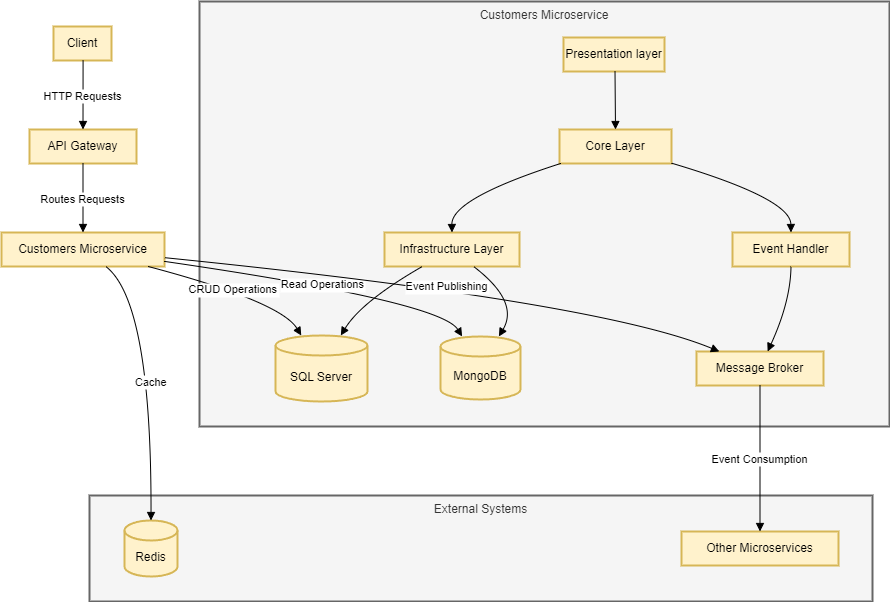

# ArdaPlace Customers Microservice

Welcome to the **ArdaPlace Customers Microservice**! This microservice is a key component of the ArdaPlace E-commerce Project, designed to manage and serve customer data efficiently.

## About the Repository

This open-source project is written in the latest version of **ASP.NET Core**, implementing the concepts of **S.O.L.I.D**, **Clean Code**, and **CQRS (Command Query Responsibility Segregation)**.

## Technologies

- **ASP.NET Core 8**
- **Entity Framework Core 8**
- **Unit & Integration Tests** with xUnit and FluentAssertions
- **Polly** for resilience and transient fault handling
- **AutoMapper** for object-object mapping
- **FluentValidator** for validation
- **MediatR** for implementing CQRS
- **Swagger UI** for API documentation
- **HealthChecks** for monitoring
- **SQL Server** for relational database
- **MongoDB** for NoSQL database
- **Redis** for caching
- **Docker & Docker Compose** for containerization

## Architecture



- Full architecture with responsibility separation concerns, adhering to SOLID principles and Clean Code practices
- **Domain Driven Design (DDD)** with layers and domain model pattern
- **Domain Events** for decoupling and handling side effects
- **Domain Notifications** for handling business rule violations
- **Domain Validations** to ensure data integrity
- **CQRS** for separating read and write operations
- **Event Sourcing** for capturing all changes to an application state as a sequence of events
- **Unit of Work** for managing transactions
- **Repository Pattern** for data access
- **Result Pattern** for handling operation results

## Running the Application

After cloning the repository to your desired folder, run the following commands in the terminal at the root of the project:

1. **Clean and build the project:**
   ```bash
   dotnet clean && dotnet build

Build and run the Docker containers:
docker-compose up --build

Access the application via Swagger UI:
http://localhost:5072/swagger/